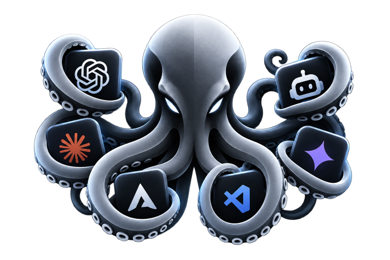

<p align="center">
  
</p>

<h1 align="center">Deep Space</h1>

<p align="center">
  <strong>Tu equipo de IA, visible y organizado.</strong>
</p>

<p align="center">
  <a href="README.md">English</a> · <a href="README.pt-BR.md">Português (Brasil)</a> · Español
</p>

Deep Space convierte los agentes de programación locales en un equipo
coordinado. Ejecuta varios agentes en un lienzo visual persistente, asigna una
función y una tarea a cada uno, comparte contexto y revisa el trabajo antes de
que llegue a tu proyecto.

<p align="center">
  <a href="https://github.com/GabryelKadmo/Deep-Space/releases/latest"><strong>Descargar Deep Space</strong></a>
  ·
  <a href="#inicio-rápido">Inicio rápido</a>
  ·
  <a href="#desarrollo">Compilar el proyecto</a>
</p>

> Deep Space es local-first. Tus proyectos y las sesiones completas de los
> agentes permanecen en tu equipo. Las integraciones opcionales usan permisos
> explícitos y las credenciales se guardan cifradas por el sistema operativo.

## Por Qué Existe Este Fork

Deep Space comenzó como una serie de correcciones a problemas que el proyecto
de origen dejó sin resolver. El ejemplo más claro: pegar en una terminal de
agente requería un atajo distinto por proveedor (Alt+V, Shift+Insert,
Ctrl+V), porque xterm cancelaba Ctrl+V y cada CLI de agente decidía por su
cuenta qué significaba eso.
[Esta corrección](https://github.com/GabryelKadmo/Deep-Space/commit/1500dd213da8fa79fc6e893f35a94419f92c5a85)
hace que pegar nativo funcione igual en todas partes. El proyecto siguió
divergiendo desde entonces, con identidad visual propia, decisiones de
interfaz y funcionalidades que el proyecto original no tiene.

## Inicio Rápido

1. **Descarga Deep Space** para macOS, Windows o Linux desde la
   [última release](https://github.com/GabryelKadmo/Deep-Space/releases/latest).
2. **Instala e inicia sesión en al menos una CLI de agente compatible**, como
   Claude Code, Codex CLI o Kimi Code.
3. **Crea un workspace** y selecciona el proyecto en el que quieres trabajar.
4. **Añade agentes, asigna tareas y conecta el contexto** directamente en el
   lienzo.

No necesitas instalar todos los proveedores ni dominar la terminal. Deep Space
detecta las CLIs disponibles en tu equipo y mantiene cada sesión separada.

## La Interfaz En Pocas Palabras

| Área | Para qué sirve |
| --- | --- |
| **Canvas** | Organiza agentes, tareas, notas, navegadores, archivos, dispositivos y documentos de diseño como nodos conectados. |
| **Workbench** | Trabaja con varios artefactos en vivo mediante pestañas y divisiones redimensionables. |
| **Maestro** | Elige un agente líder para proponer el equipo, delegar trabajo y coordinar la entrega. |
| **Tareas** | Sigue responsables y progreso en el tablero Kanban compartido. |
| **Floors** | Aísla cambios paralelos en worktrees de Git antes de revisarlos e integrarlos. |
| **Centro de Revisión** | Revisa diffs, evidencias, comentarios y aprobaciones antes de la integración. |

## Lo Que Puedes Hacer

- **Coordinar varios proveedores:** combina Claude Code, Codex CLI, Kimi Code,
  OpenCode, Cursor, Antigravity, Cline, Devin, GitHub Copilot y shells comunes
  en el mismo workspace.
- **Mantener todo conectado:** vincula tareas, notas, archivos, imágenes,
  portales, requests de API, documentos de diseño y dispositivos con sus agentes.
- **Revisar antes de integrar:** usa Floors con Git, el Centro de Revisión,
  decisiones del Council y el grafo de código para entender cada cambio.
- **Trabajar más allá del código:** investiga, diseña, prueba APIs, opera
  aplicaciones autorizadas, inspecciona apps móviles, usa Figma y genera imágenes.
- **Continuar entre sesiones:** conserva conversaciones independientes, el
  diseño del workspace, comandos guardados y automatizaciones en segundo plano.
- **Controlar el acceso:** limita carpetas, hosts, capacidades, horarios y
  acciones de riesgo; usa credenciales cifradas sin exponerlas a los agentes.
- **Usar voz o acceso remoto:** dicta y escucha respuestas con modelos locales o
  conecta una sesión Remote cifrada de extremo a extremo con vista sanitizada.

## Plataformas Compatibles

| Plataforma | Arquitecturas | Paquete |
| --- | --- | --- |
| macOS | Apple Silicon e Intel | DMG y ZIP de actualización |
| Windows | x64 | Instalador NSIS |
| Linux | x64 | AppImage y RPM |

## CLIs De Agentes Compatibles

- [Claude Code](https://docs.anthropic.com/en/docs/claude-code)
- [Codex CLI](https://github.com/openai/codex)
- [Kimi Code](https://www.kimi.com/code)
- [OpenCode](https://opencode.ai/)
- [Cursor Agent CLI](https://docs.cursor.com/en/cli/overview)
- [Antigravity CLI](https://antigravity.google/docs/cli/getting-started)
- [Cline CLI](https://docs.cline.bot/cli/cli-reference)
- [Devin CLI](https://docs.devin.ai/cli)
- [GitHub Copilot CLI](https://docs.github.com/en/copilot/how-tos/copilot-cli/set-up-copilot-cli/install-copilot-cli)

Abre el **Centro de Proveedores** desde el icono de cable del canvas, con
`Cmd/Ctrl+2`, o desde el menú nativo **Workspace** para instalar, autenticar y
comprobar proveedores.

## Desarrollo

Requisitos: Node.js 24+, npm 11+ y Git.

```bash
git clone https://github.com/GabryelKadmo/Deep-Space.git
cd Deep-Space
npm ci

npm run dev            # servidor de desarrollo de SvelteKit
npm run electron:dev   # compila y abre la aplicación de escritorio
```

Comprobaciones útiles:

```bash
npm test
npm run build
npm run test:e2e
```

La voz funciona sin Docker ni Python. En el primer uso, Deep Space solicita
confirmación antes de descargar el runtime integrado y los modelos locales.

## Mapa Del Proyecto

Deep Space utiliza Svelte 5, SvelteKit, Electron, Svelar, SQLite,
`node-pty` y `@xyflow/svelte`.

- `src/lib/modules/agent-room/` — agentes, persistencia, puente, voz y PTY
- `src/routes/canvas/` y `src/routes/terminal/` — vistas principales
- `packages/` — CLI, protocolo de colaboración, relay y plugin de Figma
- `electron/` — ciclo de vida, notificaciones, paquetes y actualizaciones
- `docs/` — guías técnicas y operativas específicas

Lee [AGENTS.md](AGENTS.md) antes de modificar la arquitectura o el flujo de
entrega.

## Documentación

- [Cómo contribuir](CONTRIBUTING.md)
- [Política de seguridad](SECURITY.md)
- [Releases de escritorio](docs/releases.md)
- [Control del ordenador](docs/computer-control.md)
- [Relay cifrado](docs/relay.md)

## Licencia

Deep Space es un fork de [Orkestrai](https://github.com/beeblock/orkestrai) y se
distribuye bajo la [Apache License 2.0](LICENSE). La atribución al proyecto de
origen se conserva en [NOTICE](NOTICE). Los componentes de terceros y los
modelos descargados siguen sujetos a las licencias de [THIRD_PARTY_NOTICES.md](THIRD_PARTY_NOTICES.md).
